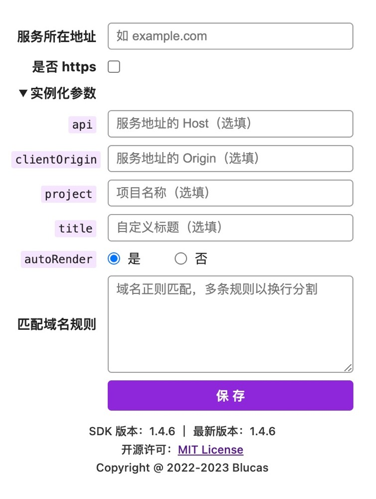

<div align="center">


# PageSpy Extension

<a href="https://www.producthunt.com/posts/pagespy?utm_source=badge-featured&utm_medium=badge&utm_souce=badge-pagespy" target="_blank"></a> <a href="https://news.ycombinator.com/item?id=38679798" target="_blank"></a>

English | [中文](./README_ZH.md)

</div>

## Intro

PageSpy Browser Extension

## 插件截图



## Features

- Automatic injection the latest version of the [HuolalaTech/page-spy](https://github.com/HuolalaTech/page-spy/) SDK.
- Automatic do the instantiation.
- Provide domain rules configuration for injection.

## Install

1. Download the [build.tar.gz](./build.tar.gz) and unpacked.
2. Open your browser and visit the "chrome://extensions".
3. Enable "Developer mode" in the top right corner.
4. Click the "Load unpacked" in the top left corner.
5. Select the unpacked "build" directory.

That's all, enjoy it ❤️.

## Contribution

```bash
git clone git@github.com:HuolalaTech/page-spy-extension.git && cd page-spy-extension

yarn install

yarn watch
```

## License

[MIT LICENSE](./LICENSE)
