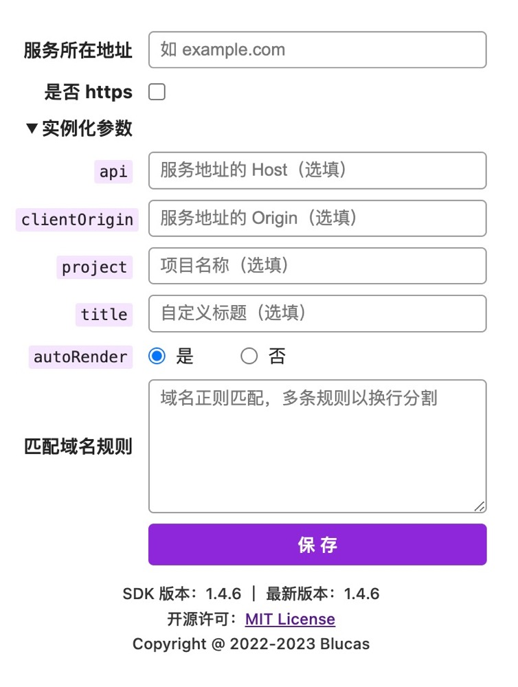

[English](./README_EN.md) | 中文


<p align="center">
  
</p>

<h1 align="center">PageSpy Extension</h1>

PageSpy 浏览器扩展

## 插件截图



## 功能特性

- 自动注入最新版本的 [HuolalaTech/page-spy](https://github.com/HuolalaTech/page-spy/) SDK；
- 自动完成实例化操作；
- 提供注入的域名配置规则；

## 安装

1. 下载 [build.tar.gz](./build.tar.gz) 并解压；
2. 打开浏览器并访问 "chrome://extensions"；
3. 在页面右上角开启 "开发者模式"；
4. 点击页面左上角的 "加载"；
5. 选择解压后的 "build" 目录；

以上就是全部，希望你使用愉快 ❤️。

## 贡献

```bash
git clone git@github.com:HuolalaTech/page-spy-extension.git && cd page-spy-extension

# 安装依赖
yarn install

# 开发
yarn watch

# 构建
yarn build

# 一键打包
yarn update
```

## License

[MIT LICENSE](./LICENSE)
