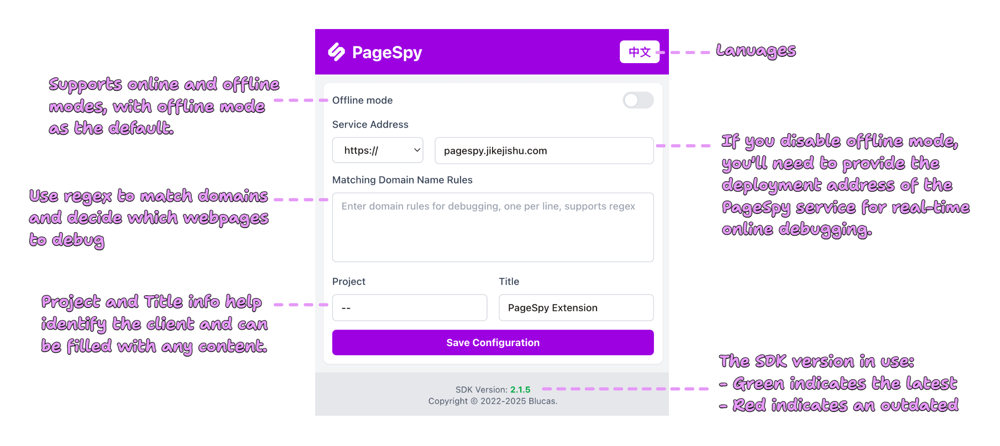

English | [中文](./README_ZH.md)

## Intro

PageSpy extension for debugging user pages simply.

## Features

- Automatic injection the latest version of SDK.
- Automatic do the instantiation with default configuration.
- Provide domain rules configuration for injection.

## Usage

1. Download the `dist.tar.gz` in the [release page](https://github.com/HuolalaTech/page-spy-extension/releases).
2. Open your browser and visit the "chrome://extensions".
3. Enable "Developer mode" in the top right corner.
4. Click the "Load unpacked" in the top left corner.
5. Select the unpacked "dist" directory.

That's all, enjoy it ❤️.

## Screenshot

<blockquote>
  

    
Usage Example: Debug Google

    
  

</blockquote>

