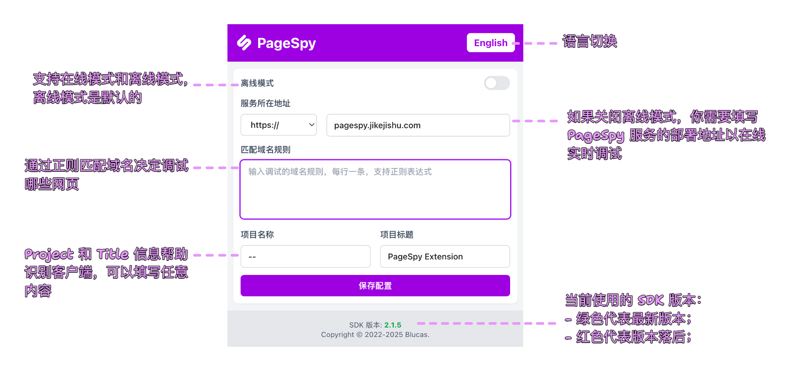

[English](./README.md) | 中文

## 介绍

使用 PageSpy 浏览器扩展让调试用户页面变得简单。

## 特性

- 自动注入最新版本的 SDK；
- 使用默认配置自动进行实例化；
- 提供配置决定注入哪些页面；

## 使用

### 直接安装

> 记得给个好评哦~ 😉

点击前往 [Chrome 应用商店](https://chromewebstore.google.com/detail/pagespy/kpfigmbgeedkgnjnlpilghiffepahlmk) 安装。

### 手动安装

1. 在 [release 页面](https://github.com/HuolalaTech/page-spy-extension/releases) 下载 `dist.tar.gz` 并解压；
2. 打开浏览器并访问 "chrome://extensions"；
3. 在页面右上角开启 "开发者模式"；
4. 点击页面左上角的 "加载已解压的扩展程序"；
5. 选择解压后的 "dist" 目录；

以上就是全部，希望你使用愉快 ❤️。

## 截图

<blockquote>
  

    
参考示例：调试百度

    
  

</blockquote>

