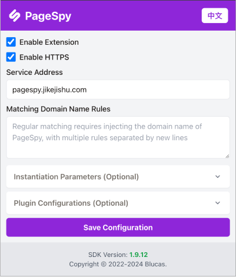

## Intro

PageSpy extension for real-time debugging user pages.

## Features

- Automatic injection the latest version of the [HuolalaTech/page-spy](https://github.com/HuolalaTech/page-spy/) SDK.
- Automatic do the instantiation with default configuration.
- Provide domain rules configuration for injection.

## Screenshot

